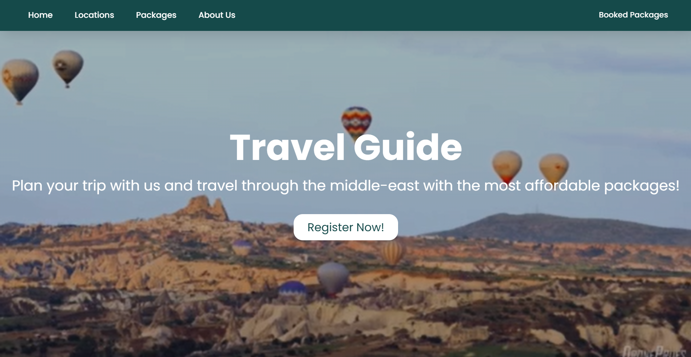
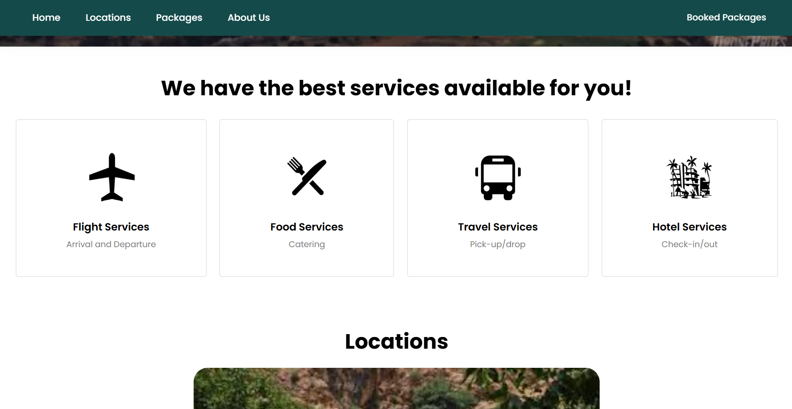
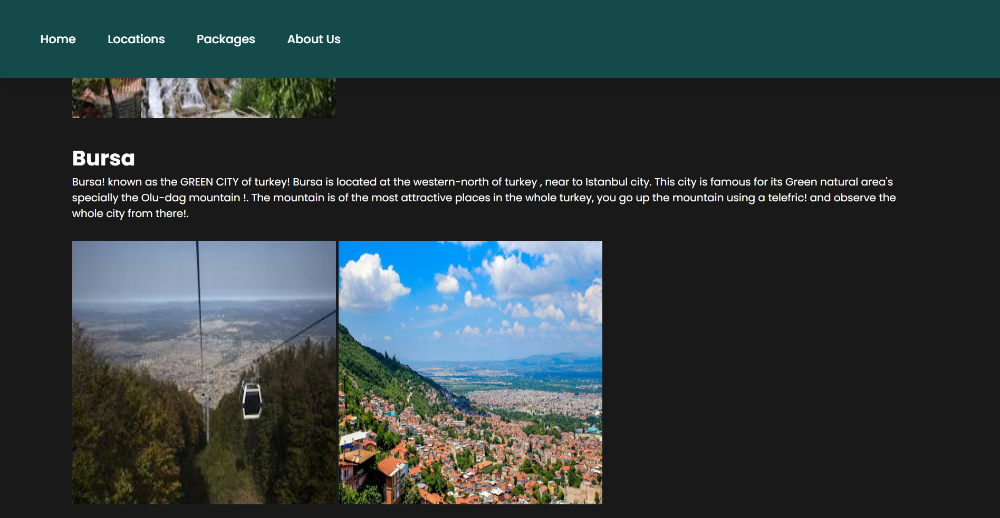
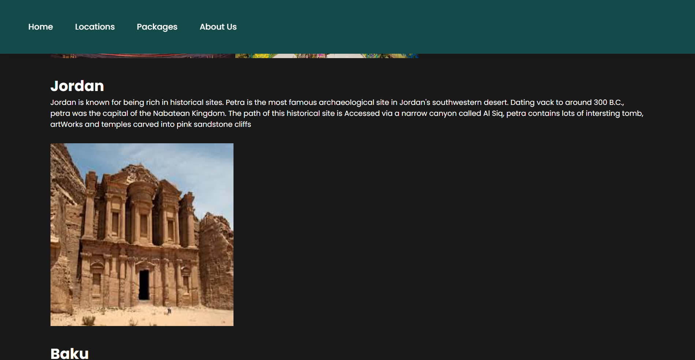
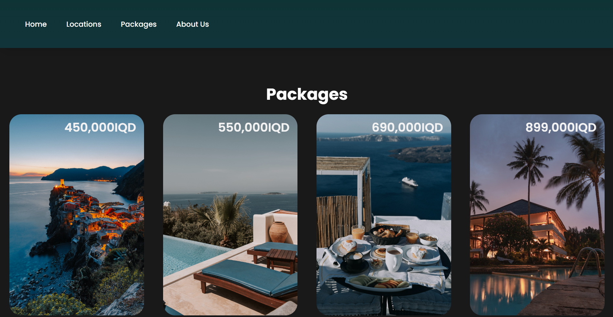
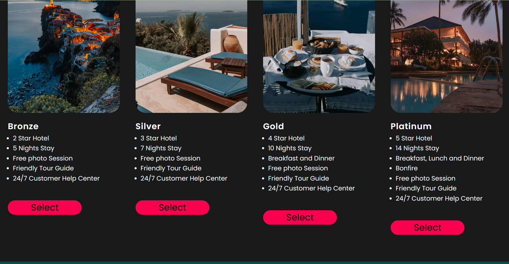
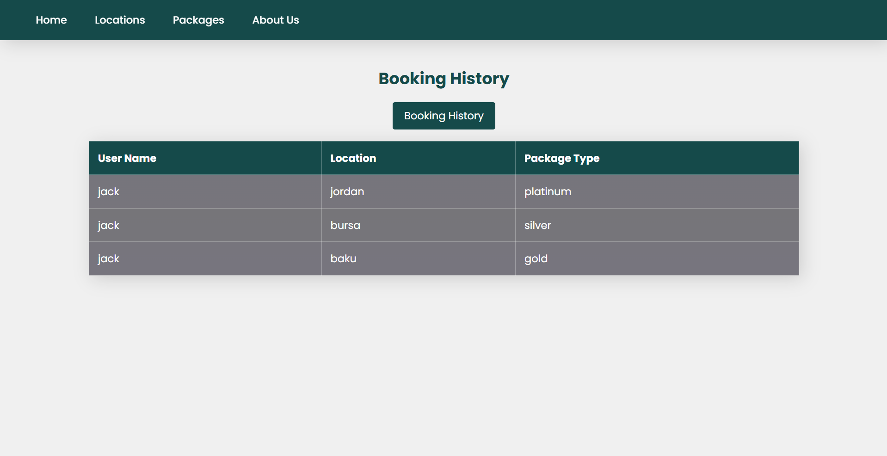

# Travel-Guide Website 🧳✈️🗽
A Travel Guide Website, that suggests different locations to visit with different type of packages. Built using html, css, JS, and PHP.

## Features
- Registration.
- View available locatation to travel to.
- Having different packages available for each location.
- Book packages.
- View booked packages.

## Technologies
- html
- css
- Javascript
- php
- Mysql

## Screenshots

## How to run the website
1. Clone to the repository into a folder.
2. Recommended to have Xammp.
3. Add the folder into /htdocs directory within xammp.
4. Make sure both PhpMyAdmin and Mysql are running.
5. Open Mysql admin dashboard via Xammp control panel.
6. Create a database named as 'registered'
7. Import the SQL file within the project into the database
8. Run the website by typing 'http://localhost/travel-guide-website' in your browser.
   

